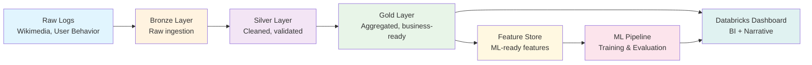

# Churn Modeling at Scale - Databricks Solution Accelerator

> **Enterprise-grade churn prediction and retention analytics framework**  
> Built for scale, designed for insights, optimized for Databricks

[](https://databricks.com/)
[](https://spark.apache.org/)
[](https://python.org/)
[](https://delta.io/)

## What This Accelerator Solves

**Business Challenge**: Early subscriber churn creeping above forecast, requiring data-driven insights to shape product and marketing strategy.

**Technical Challenge**: Processing behavioral logs at scale to extract predictive signals and explainable insights.

**Solution**: End-to-end churn modeling pipeline from raw data ingestion to executive-ready dashboards, built on Databricks for enterprise scalability.

## Key Capabilities

### **Data Engineering Excellence**

- **Multi-layer architecture**: Bronze → Silver → Gold data pipeline
- **Delta Lake integration**: ACID transactions, schema evolution, time travel
- **Quality gates**: Automated data validation, outlier detection, late record handling
- **Partitioning strategy**: Optimized for query performance and cost efficiency

### **Advanced Analytics**

- **Engagement KPIs**: DAU/WAU/MAU, session metrics, content diversity
- **Churn prediction**: Binary classification with configurable churn windows
- **Feature engineering**: Behavioral patterns, temporal features, cohort analysis
- **Model explainability**: SHAP, permutation importance, feature attribution

### **Business Intelligence**

- **Interactive dashboards**: Self-service analytics for stakeholders
- **Cohort analysis**: Retention heatmaps, survival curves
- **Risk scoring**: Real-time churn probability with key drivers
- **Executive narrative**: Dashboard-driven storytelling, no slides needed

## Architecture Overview



## 🛠️ Technology Stack

| Component           | Technology            | Purpose                                |
| ------------------- | --------------------- | -------------------------------------- |
| **Data Processing** | Apache Spark 3.4+     | Distributed computing backbone         |
| **Data Lake**       | Delta Lake            | ACID transactions, schema evolution    |
| **Platform**        | Databricks            | Managed Spark, MLflow, Unity Catalog   |
| **ML Framework**    | Scikit-learn, XGBoost | Model training and evaluation          |
| **Explainability**  | SHAP, ELI5            | Model interpretation                   |
| **Visualization**   | Plotly, Dash          | Interactive charts and dashboards      |
| **BI Dashboard**    | Databricks Dashboards | Native BI interface with Unity Catalog |

## 📁 Project Structure

```
churn-modeling-at-scale/
├── notebooks/                    # Databricks notebooks
│   ├── 01_data_ingestion/      # Bronze layer creation
│   ├── 02_data_processing/     # Silver layer transformation
│   ├── 03_feature_engineering/ # Gold layer and ML features
│   ├── 04_modeling/           # ML pipeline and training
│   └── 05_dashboard/          # Databricks dashboard queries
├── src/                        # Python source code
│   ├── data/                  # Data processing modules
│   ├── features/              # Feature engineering
│   ├── models/                # ML model definitions
│   ├── evaluation/            # Model evaluation metrics
│   └── visualization/         # Chart and dashboard components
├── config/                    # Configuration files
│   ├── databricks.json       # Databricks connection config
│   └── model_params.yaml     # ML hyperparameters
├── tests/                     # Unit and integration tests
├── docs/                      # Documentation and guides
├── requirements.txt           # Python dependencies
└── README.md                 # This file
```

## Quick Start

### Prerequisites

- Databricks workspace (Community Edition or higher)
- Python 3.8+
- Apache Spark 3.4+

### 1. Clone and Setup

```bash
git clone https://github.com/your-org/churn-modeling-at-scale.git
cd churn-modeling-at-scale
pip install -r requirements.txt
```

### 2. Configure Databricks

```bash
# Copy and configure your Databricks connection
cp config/databricks.json.example config/databricks.json
# Edit with your workspace details
```

### 3. Run the Pipeline

```bash
# Execute the complete pipeline
python src/main.py --config config/pipeline_config.yaml

# Or run individual components
python src/data/ingest.py --source wikimedia --target bronze
python src/features/engineer.py --input silver --output gold
python src/models/train.py --features gold --output models/
```

## Data Pipeline

### Bronze Layer (Raw Ingestion)

- **Purpose**: Preserve raw data exactly as received
- **Format**: Delta tables with minimal transformation
- **Quality**: Basic schema validation, duplicate detection
- **Partitioning**: Date-based partitioning for efficient querying

### Silver Layer (Cleaned Data)

- **Purpose**: Business-ready, cleaned datasets
- **Transformations**: Data type casting, null handling, outlier detection
- **Quality**: Automated data quality checks, business rule validation
- **Enrichment**: Basic aggregations, derived fields

### Gold Layer (Business Aggregates)

- **Purpose**: ML-ready features and business KPIs
- **Features**: User engagement metrics, behavioral patterns, cohort labels
- **Aggregations**: Daily/weekly/monthly summaries, rolling windows
- **Output**: Structured datasets optimized for ML training

## Churn Modeling Approach

### Problem Definition

- **Target**: Binary classification (churn vs. retain)
- **Window**: Configurable churn definition (e.g., 30, 60, 90 days)
- **Features**: Behavioral, temporal, and demographic signals

### Feature Engineering

- **Engagement Features**: Session frequency, duration, content consumption
- **Temporal Features**: Day-of-week patterns, seasonal trends
- **Cohort Features**: Signup month, initial behavior patterns
- **Derived Features**: Rolling averages, change rates, ratios

### Model Selection

- **Baseline**: Logistic regression for interpretability
- **Advanced**: XGBoost for performance, SHAP for explainability
- **Evaluation**: ROC-AUC, PR-AUC, precision-recall curves
- **Validation**: Time-based cross-validation to prevent data leakage

## Dashboard & Visualization

### Databricks Native Dashboard

- **Churn Overview**: Current rates, trends, and forecasts
- **Cohort Analysis**: Retention curves, survival analysis
- **Risk Scoring**: Individual user churn probability
- **Driver Analysis**: Top factors influencing churn

### Native Databricks Features

- **Unity Catalog Integration**: Secure data access and governance
- **Real-time Updates**: Live data refresh from Delta tables
- **Interactive Filters**: Dynamic filtering and drill-down capabilities
- **Export Options**: PDF reports, data extracts for stakeholders
- **Collaborative Sharing**: Team access with role-based permissions

## 🔧 Configuration & Customization

### Environment Variables

```bash
export DATABRICKS_HOST="your-workspace.cloud.databricks.com"
export DATABRICKS_TOKEN="your-personal-access-token"
export DATABRICKS_CLUSTER_ID="your-cluster-id"
```

### Model Parameters

```yaml
# config/model_params.yaml
churn_window_days: 90
feature_engineering:
  rolling_windows: [7, 14, 30]
  engagement_thresholds:
    active_user: 3
    power_user: 10
model:
  algorithm: 'xgboost'
  hyperparameters:
    max_depth: 6
    learning_rate: 0.1
    n_estimators: 100
```

## Testing & Quality Assurance

### Test Coverage

```bash
# Run all tests
pytest tests/ -v --cov=src

# Run specific test categories
pytest tests/unit/ -v
pytest tests/integration/ -v
pytest tests/e2e/ -v
```

### Data Quality Checks

- Schema validation
- Completeness checks
- Range and distribution validation
- Business rule enforcement
- Anomaly detection
