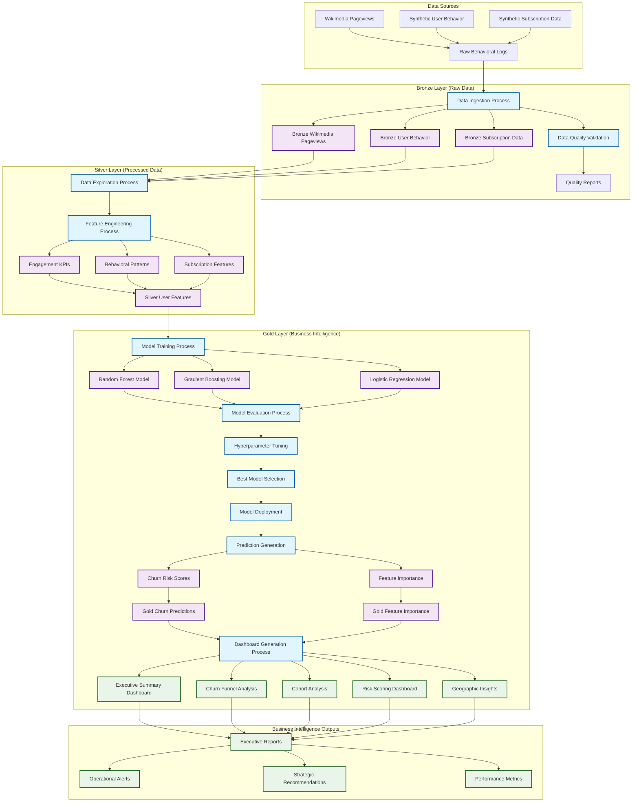

# The Cost of Not Knowing Your Customer: Quantifying Churn's Financial Impact

_A data-driven approach to preventing revenue leakage through predictive churn modeling_

---

## Slide 2: Problem Statement & Business Context

### The Churn Challenge: A Silent Revenue Killer

Customer churn represents one of the most significant threats to subscription-based businesses, yet it remains notoriously difficult to predict and prevent. Early-stage subscriber churn—customers who cancel within their first 90 days—has quietly crept above forecast levels, creating a critical business challenge that requires immediate attention. This phenomenon is particularly concerning because early-stage customers represent the highest acquisition costs and the greatest potential for long-term revenue generation.

The fundamental problem lies in the reactive nature of traditional churn management approaches. Most businesses only become aware of churn risk when customers have already decided to leave, at which point intervention strategies are often too late to be effective. This reactive approach results in significant revenue loss, wasted marketing spend, and missed opportunities for customer success optimization.

### Why Churn Prediction Matters: The Financial Imperative

The business case for predictive churn modeling is compelling and quantifiable. Research indicates that the cost of acquiring a new customer is five to 25 times higher than retaining an existing one. For subscription-based businesses, this cost differential becomes even more pronounced when considering the lifetime value of retained customers versus the sunk costs of customer acquisition.

**Industry Statistics on Churn Impact:**

• **Revenue Loss**: The average subscription business loses 5-7% of its revenue annually due to preventable churn
• **Customer Acquisition Cost (CAC)**: Companies spend $1,000-$5,000 to acquire a single B2B customer
• **Lifetime Value (LTV)**: A 5% improvement in customer retention can increase profits by 25-95%
• **Early-Stage Risk**: 40-60% of churned customers leave within the first 90 days of subscription

The financial implications extend beyond direct revenue loss. Churned customers represent lost opportunities for upselling, cross-selling, and referral generation. Additionally, high churn rates can damage brand reputation, reduce investor confidence, and create operational inefficiencies as customer success teams struggle to maintain service quality with constantly changing customer bases.

### The Hidden Costs of Reactive Churn Management

Traditional churn management approaches suffer from several critical limitations that amplify their financial impact:

**Timing Issues**: By the time traditional metrics identify at-risk customers, they have often already made the decision to churn. This late-stage intervention window severely limits the effectiveness of retention strategies.

**Resource Allocation Problems**: Without predictive insights, customer success teams must treat all customers equally, leading to inefficient resource allocation and missed opportunities to prevent high-value customer churn.

**Data Fragmentation**: Customer behavior data often exists in silos across different systems, making it difficult to create a comprehensive view of customer health and engagement patterns.

**Scalability Challenges**: Manual churn analysis and intervention strategies don't scale effectively as customer bases grow, leading to increased operational costs and decreased effectiveness.

---

## Slide 3: Methodology Overview

### A Multi-Layer Data Architecture for Predictive Churn Modeling

Our solution addresses the churn prediction challenge through a comprehensive, scalable methodology that combines advanced data engineering, machine learning, and business intelligence. The approach is built on a modern data architecture that ensures data quality, scalability, and real-time processing capabilities.

### Data Architecture: Bronze-Silver-Gold Framework

The foundation of our methodology is a three-layer data architecture that ensures data quality, consistency, and accessibility throughout the analytics pipeline:

**Bronze Layer (Raw Data)**: This layer serves as the landing zone for all raw data sources, including behavioral logs, subscription data, and external data feeds. Data is stored in its original format with minimal transformation, preserving the complete audit trail and enabling data lineage tracking. The bronze layer handles data ingestion, basic validation, and initial quality checks.

**Silver Layer (Processed Data)**: The silver layer transforms raw data into clean, structured datasets suitable for analysis and modeling. This layer implements data quality rules, handles missing values, performs data type conversions, and creates standardized schemas. Feature engineering occurs primarily in this layer, where we create derived metrics, aggregations, and business-specific calculations.

**Gold Layer (Business Intelligence)**: The gold layer contains curated datasets optimized for business intelligence and reporting. This layer includes pre-calculated metrics, model predictions, and aggregated insights that support executive decision-making and operational dashboards.

### Machine Learning Pipeline: From Data to Predictions

Our machine learning methodology follows a systematic approach designed to maximize predictive accuracy while ensuring model interpretability and business relevance:

**Feature Engineering Strategy**: We employ a comprehensive feature engineering approach that captures multiple dimensions of customer behavior and engagement. This includes:

• **Engagement Metrics**: Daily, weekly, and monthly active user calculations, session frequency, and feature adoption rates
• **Behavioral Patterns**: Usage frequency, feature utilization patterns, and interaction sequences
• **Subscription Attributes**: Plan type, billing cycle, payment method, and lifecycle stage classification
• **Temporal Features**: Recency, frequency, and seasonality patterns in customer activity

**Model Selection and Validation**: Our approach utilizes multiple machine learning algorithms to ensure robust predictions:

• **Random Forest**: Primary algorithm for its ability to handle non-linear relationships and provide feature importance rankings
• **Gradient Boosting**: Secondary algorithm for capturing complex interaction patterns
• **Logistic Regression**: Baseline model for interpretability and comparison purposes

**Hyperparameter Optimization**: We employ cross-validation and systematic hyperparameter tuning to optimize model performance while preventing overfitting.

### Scalability and Production Readiness

The methodology is designed for enterprise-scale deployment with several key scalability features:

**Distributed Processing**: Built on Apache Spark for handling large-scale datasets and real-time processing requirements. The architecture can scale horizontally to accommodate growing data volumes and processing demands.

**Real-Time Capabilities**: The pipeline is designed to support both batch and streaming data processing, enabling real-time churn risk scoring and immediate intervention opportunities.

**Model Management**: Integration with MLflow for experiment tracking, model versioning, and deployment management ensures reproducibility and operational reliability.

**Data Quality Assurance**: Comprehensive data quality monitoring and validation at each layer ensures reliable predictions and maintains data integrity throughout the pipeline.

### Large-Scale Data Optimization Strategy

Given the massive scale of our dataset (5.3 billion records), we implement a comprehensive optimization strategy to ensure optimal performance and cost efficiency:

**Partitioning Strategy**: Data is partitioned by `file_timestamp` and `project` to enable efficient pruning during query execution. This dual-level partitioning allows for:
• **Temporal filtering**: Queries filtering by date ranges can skip irrelevant partitions
• **Project-based filtering**: Analysis focusing on specific Wikipedia projects benefits from partition elimination
• **Balanced partition sizes**: Prevents data skew and ensures optimal parallel processing

**Delta Lake Optimization Techniques**:
• **OPTIMIZE command**: Compacts small files into larger, more efficient files for improved I/O performance
• **Z-ORDER clustering**: Co-locates related data (by project, access_method, and view_count) to minimize data scanning
• **Automatic file compaction**: Reduces the number of files from potentially millions to thousands
• **Vacuum operations**: Removes obsolete files to maintain storage efficiency

**Performance Enhancements**:
• **Column statistics**: Maintains detailed statistics for all columns to enable cost-based optimization
• **Bloom filters**: Automatically generated for high-cardinality columns to speed up point lookups
• **Liquid clustering**: Dynamically optimizes data layout based on query patterns over time

### Business Intelligence Integration

The methodology extends beyond predictive modeling to include comprehensive business intelligence capabilities:

**Executive Dashboards**: Real-time dashboards provide executives with key metrics, churn risk distributions, and trend analysis to support strategic decision-making.

**Operational Alerts**: Automated alerting systems notify customer success teams of high-risk customers, enabling proactive intervention strategies.

**Performance Tracking**: Continuous monitoring of model performance and business impact ensures the solution remains effective as business conditions evolve.

This comprehensive methodology addresses not only the technical challenges of churn prediction but also the business requirements for actionable insights and scalable operations. The combination of advanced data engineering, machine learning, and business intelligence creates a solution that can deliver measurable business value while maintaining the flexibility to adapt to changing business needs.

### System Architecture Diagram

The following diagram illustrates the complete data flow and processing pipeline from raw data ingestion to business intelligence delivery:

